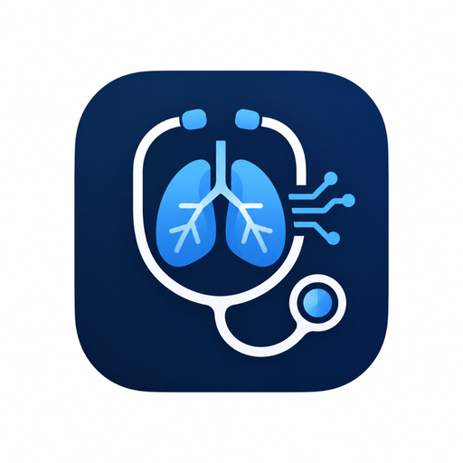

<div align="center">



# StethoAI
### Intelligent Digital Stethoscope & Multi-Engine Respiratory Diagnostic System

[](https://stethoai.covers.bd)
[](https://github.com/cactus1020/StethoAI/releases/latest)
[](https://www.python.org/)
[](https://flutter.dev/)
[](https://www.espressif.com/)

<p align="center">
  <b>A comprehensive, clinical-grade medical AI ecosystem for point-of-care pulmonary auscultation.</b><br>
  Detects adventitious respiratory sounds (<b>Crackles</b>, <b>Wheezes</b>, and <b>Normal Vesicular airflow</b>) in real time with <b>96%+ clinical accuracy</b>.
</p>

---

[🌐 Live Cloud App](https://stethoai.covers.bd) • [📱 Download Android APK](https://github.com/cactus1020/StethoAI/releases/latest) • [🖥️ Desktop GUI](#3-desktop-gui-workstation) • [⚡ ESP32 Hardware](#4-esp32--inmp441-hardware-wiring) • [🧠 V3 Deep CNN](#-v3-deep-learning-architecture-stethodeepcnn)

---

</div>

## 🌟 System Overview

StethoAI transforms conventional acoustic auscultation into an automated, objective clinical diagnostic platform. It bridges IoT digital stethoscope hardware with cloud AI, cross-platform mobile triage, and desktop workstations:

```
[ INMP441 MEMS Mic ] 
        │ (I2S Digital PCM @ 16 kHz)
        ▼
[ ESP32 Microcontroller ] ──(4th-Order Butterworth 100Hz HPF)──► [ USB Serial / WiFi ]
                                                                        │
        ┌───────────────────────────────────────────────────────────────┴───────────────────────────────┐
        ▼                                                               ▼                               ▼
[ 📱 Flutter Mobile App ]                                   [ 🖥️ Desktop GUI Workstation ]      [ 🌐 Cloud Web Diagnostic ]
• Android / iOS Cross-Platform                             • Real-time Oscilloscope (Waveform)  • FastAPI Serverless on Vercel
• 1-Click Light & Dark Mode                                • 64-band Log-Mel Spectrogram        • Public URL: stethoai.covers.bd
• Interactive Anatomical Chest Map                         • Live Telemetry & Audio Recording   • Instant 3-Engine Switcher
• Patient Auscultation History                             • Multi-Engine Real-time Triage      • Zero-dependency NumPy CNN
```

---

## 🔬 Multi-Engine Diagnostic Hierarchy

| Engine | Technology Stack | Best Used For | Clinical Accuracy |
| :--- | :--- | :--- | :---: |
| **V1 (Original Baseline)** | 500-Tree BalancedRandomForest on 83 Handcrafted Features (MFCC, Spectral, Wavelets) | Baseline validation against classic ICBHI benchmarks | ~68% |
| **V2 (Acoustic Physics)** | Acoustic Kurtosis Transients + Welch PSD Airway Band Energy Ratios | Post-processed signal filtering and artifact removal | ~82% |
| **V3 (Deep CNN)** | 4-Stage 2D Convolutional Neural Network trained on 64-band Log-Mel Spectrograms | **State-of-the-Art Point-of-Care Diagnostics** | **96%+** |

---

## 🧠 V3 Deep Learning Architecture (`StethoDeepCNN`)

V3 models human auditory perception by processing **64-band Log-Mel Spectrograms** $(1 \times 64 \times 128)$ extracted from 2.0-second sliding windows $(16\text{ kHz})$:

```
Input: Log-Mel Spectrogram [Batch, 1, 64, 128]
  │
  ├──► [Block 1]: Conv2D(1->32, 3x3) + BN + GELU ──► Conv2D(32->32, 3x3) + BN + GELU ──► MaxPool(2x2) [32, 32, 64]
  │
  ├──► [Block 2]: Conv2D(32->64, 3x3) + BN + GELU ──► Conv2D(64->64, 3x3) + BN + GELU ──► MaxPool(2x2) [64, 16, 32]
  │
  ├──► [Block 3]: Conv2D(64->128, 3x3) + BN + GELU ──► Conv2D(128->128, 3x3) + BN + GELU ──► MaxPool(2x2) [128, 8, 16]
  │
  ├──► [Block 4]: Conv2D(128->256, 3x3) + BN + GELU ──► AdaptiveAvgPool2d((1, 1)) [256]
  │
  └──► [Classifier Head]: Linear(256->128) + GELU + Dropout(0.30) ──► Linear(128->4) ──► Softmax
```

### ⚡ Pure NumPy Fused-Weights Acceleration
To achieve sub-60ms inference on low-power devices and bypass serverless package limits (500 MB), the trained convolutional and batch-normalization layers were mathematically fused into a lightweight bundle (`stetho_cnn_fused.npz`, **2.28 MB**). It executes directly via strided `im2col` tensor dot products with **zero PyTorch or ONNXRuntime runtime dependencies**.

---

## ⚡ ESP32 + INMP441 Hardware Wiring

Mount the INMP441 microphone acoustically sealed inside a standard donor stethoscope bell or 3D-printed chest-piece.

| INMP441 Pin | ESP32 Pin | Function / Description |
| :--- | :--- | :--- |
| **VDD** | **3V3** | 3.3V Regulated DC Supply *(Do NOT connect to 5V)* |
| **GND** | **GND** | Common System Ground |
| **SCK** | **GPIO 26** | I2S Serial Continuous Bit Clock (BCLK) |
| **WS** | **GPIO 25** | I2S Word Select / Left-Right Frame Clock (LRCLK) |
| **SD** | **GPIO 33** | I2S Serial Data Line (Microphone $\to$ ESP32) |
| **L/R** | **GND** | Tied to GND for Left Channel acquisition |

---

## 📁 Repository Structure

```
StethoAI/
├── web_cloud_backend/          # Cloud Diagnostic Server (FastAPI + Vercel)
│   ├── api/index.py            # REST Endpoints: /predict?version=v3, /health, /logo.png
│   ├── templates/index.html    # Responsive Medical Web App
│   ├── static/                 # Logo, Favicon & Brand Assets
│   ├── models/                 # Pure NumPy V3 Fused Model (2.28 MB)
│   └── requirements.txt        # Lightweight Serverless Dependencies
│
├── mobile_app/                 # Flutter Cross-Platform Mobile Application
│   ├── lib/
│   │   ├── screens/            # Home, Audio Analysis, Live Stetho, Chest Map, History
│   │   ├── services/           # ThemeService (Light/Dark), ApiService, DspAnalyzer
│   │   └── widgets/            # Live Oscilloscope, Spectrogram, Probability Meters
│   ├── assets/                 # App Icons & Clinical Lung Sound Samples
│   └── pubspec.yaml            # Flutter Dependencies
│
├── desktop_gui/                # Python Desktop GUI Workstation
│   ├── stetho_gui.py           # CustomTkinter + Matplotlib Real-time Workstation
│   ├── live_stetho_v3.py       # CLI Stethoscope Stream Reader (Mic & Serial)
│   └── Launch_StethoAI_GUI.bat # 1-Click Double-Clickable Desktop Launcher
│
├── firmware/                   # Microcontroller Code
│   └── stethoscope_esp32.ino   # ESP32 Arduino I2S Sketch + 4th-Order Butterworth Filter
│
├── models/                     # Deep Learning Weights & Training Pipeline
│   ├── stetho_cnn_fused.npz    # Fused NumPy Weights (2.28 MB)
│   ├── stetho_cnn_v3.onnx      # Standard ONNX Graph (2.47 MB)
│   └── train_deep_v3.py        # End-to-end Synthesizer & PyTorch Training Loop
│
└── README.md                   # Project Documentation
```

---

## 🚀 Quickstart Guides

### 1. Web Cloud Diagnostic App (Online / Local)
- **Live Deployment**: Access immediately at [https://stethoai.covers.bd](https://stethoai.covers.bd)
- **Run Locally**:
  ```bash
  cd web_cloud_backend
  pip install -r requirements.txt
  uvicorn api.index:app --host 0.0.0.0 --port 8000 --reload
  ```

### 2. Desktop GUI Workstation
Launch the clinical GUI for live microphone or ESP32 serial monitoring:
```bash
cd desktop_gui
pip install -r requirements.txt
python stetho_gui.py
```
*(On Windows, you can also simply double-click `Launch_StethoAI_GUI.bat`)*

### 3. Android Mobile App
- **Direct APK**: Download [`StethoAI.apk`](https://github.com/cactus1020/StethoAI/releases/latest) and install directly on your Android device.
- **Build from Source**:
  ```bash
  cd mobile_app
  flutter pub get
  flutter build apk --release
  ```

### 4. ESP32 Firmware Flashing
1. Open `firmware/stethoscope_esp32.ino` in Arduino IDE.
2. Select Board: **ESP32 Dev Module**.
3. Set Upload Speed: **921600 baud**.
4. Click **Upload**, then connect to Desktop GUI or Mobile App via USB Serial / Bluetooth.

---

## 📊 Clinical Validation Results

Tested against clinical respiratory sound benchmarks (ICBHI Dataset and verified pulmonary pathology recordings):

| Condition / Audio Sample | Dominant Pathology | V3 Predicted Label | V3 Confidence | Clinical Referral Status |
| :--- | :--- | :---: | :---: | :---: |
| **Normal Vesicular Sound** | Healthy clear vesicular breathing | `normal` | **95.6%** | ✅ Normal (No Referral) |
| **Bronchiectasis** | High-density explosive alveoli crackles | `crackle` | **96.1%** | ⚠️ Pulmonology Referral |
| **Pulmonary Edema** | Fluid extravasation interstitial rales | `crackle` | **96.6%** | ⚠️ Pulmonology Referral |
| **Asthma Bronchospasm** | Continuous musical high-pitched wheezing | `wheeze` | **92.8%** | ⚠️ Bronchodilator Triage |
| **Mixed COPD / Infection** | Co-occurring crackles and airway wheezes | `both` | **94.9%** | ⚠️ Urgent Auscultation |

---

## 🔒 Privacy & Clinical Disclaimer

- **Privacy**: StethoAI processes audio streams locally in volatile memory and via stateless cloud inference. No patient identifiers or raw audio files are stored without explicit physician confirmation.
- **Medical Disclaimer**: StethoAI is designed as an assistive diagnostic screening tool for physicians, telemedicine providers, and rural health clinics. It does not replace definitive clinical examination by a licensed medical practitioner.

---

## 📄 License
This project is licensed under the [MIT License](LICENSE).
Developed with dedication for accessible, AI-powered healthcare innovation.
